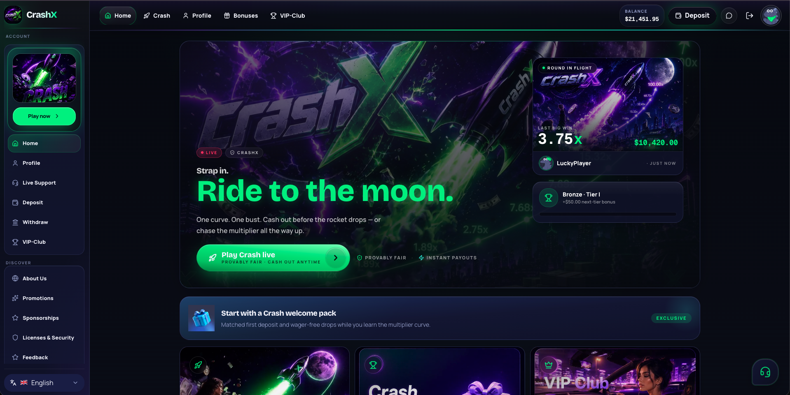
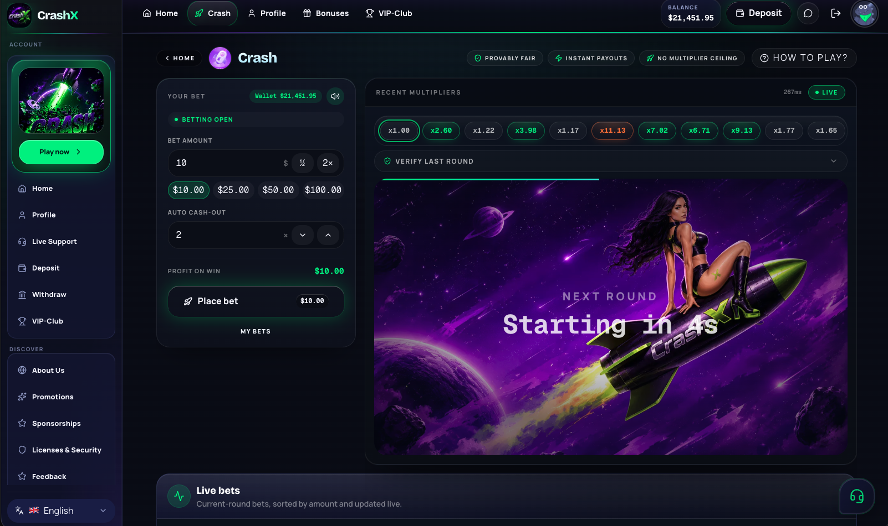

# CrashX API

Laravel backend for **CrashX** — provably fair crypto crash, wallet, VIP, support, and a Filament operator console.

Published by [Script.Casino](https://script.casino/). Frontend: [**CrashX Portal**](https://github.com/scriptcasino/free-casino-script-portal) (companion repo).





## Requirements

- PHP 8.4, Composer 2
- Docker (recommended) via [Laravel Sail](https://laravel.com/docs/sail)
- PostgreSQL 18, Redis

## Install

```bash
cp .env.example .env
composer install
php artisan key:generate
ADMIN_PASSWORD='your-secure-password' php artisan migrate --seed
```

**With Sail** (from this directory):

```bash
cp .env.example .env
./vendor/bin/sail up -d
./vendor/bin/sail artisan key:generate
ADMIN_PASSWORD='your-secure-password' ./vendor/bin/sail artisan migrate --seed
```

Portal: set `NEXT_PUBLIC_API_URL` in the portal’s `.env.local` (often `http://127.0.0.1` when API is on Sail port 80), then `npm run dev` in the portal project.

## Admin panel

| | |
|---|---|
| URL | `{APP_URL}/{ADMIN_PANEL_PATH}/login` — path from `ADMIN_PANEL_PATH` in `.env` |
| User | `crashx_internal_admin` ([`AdminSeeder`](database/seeders/AdminSeeder.php)) |
| Password | `ADMIN_PASSWORD` in `.env` before seeding |

```bash
ADMIN_PASSWORD='your-secure-password' php artisan db:seed --class=AdminSeeder
```

Filament uses the `admin` guard (not API users / Sanctum). Change the password before production.

## Tenant

Default slug: `crashx`.

```bash
./vendor/bin/sail artisan tenant:create crashx "CrashX" --tagline="Crypto Crash" --force
```

## Crash engine

```bash
./vendor/bin/sail artisan crash:emit-tick crashx
./vendor/bin/sail artisan crash:new-round crashx
```

Live ops: Filament → **Gaming → Crash live ops**.

## Realtime (optional)

Default `sail up -d` is enough without websockets.

For Soketi:

1. `COMPOSE_PROFILES=realtime` in `.env`, or `sail up -d --profile realtime`
2. `PUSHER_HOST=soketi` — keys must match `.env.example` (`local-crashx*`)
3. Portal: `NEXT_PUBLIC_PUSHER_APP_KEY`, `NEXT_PUBLIC_WS_HOST=127.0.0.1`, port `6001`

Channels: `private-tenants.{slug}.crash` (players), `private-tenants.{slug}.crash-ops` (admin).

## API (v1)

| Endpoint | |
|----------|--|
| `GET /api/v1/health` | Service id `crashx-api` |
| `GET /api/v1/site/config`, `site/crash-state` | Public site + crash snapshot |
| Auth | Register, login, recovery, Sanctum `me` / logout |
| Wallet | Balance, history, withdraw |
| Crash | State, place bet, cashout, history |
| Support | Guest threads + broadcast auth |

Rate limits: [`AppServiceProvider`](app/Providers/AppServiceProvider.php).

## ZIP release

Build from the workspace that contains `api/` and `portal/`:

```bash
./scripts/build-release-zips.sh
```

Output: `release/crashx-api-YYYYMMDD.zip` (source only — no `vendor/`, `.env`, or `.git`). Buyers run `composer install` after extract.

## Production notes

- `APP_DEBUG=false`, strong `ADMIN_PASSWORD`, rotate Soketi secrets
- `FRONTEND_URL`, `SANCTUM_STATEFUL_DOMAINS`, `CORS_ALLOWED_ORIGINS` must match the portal origin
- [`Dockerfile`](Dockerfile) needs your own `deploy/` configs (not in this repo)
- Vulnerabilities: [SECURITY.md](SECURITY.md)

**Postgres volume reset** (only if `pgsql` fails on first boot):

```bash
./vendor/bin/sail down && docker volume rm api_sail-pgsql && ./vendor/bin/sail up -d
```

## License

MIT — [LICENSE](LICENSE). © [Script.Casino](https://script.casino/).
